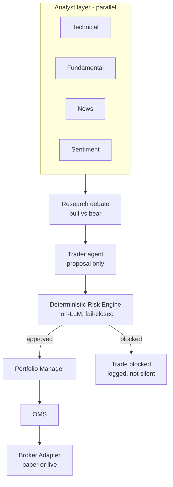
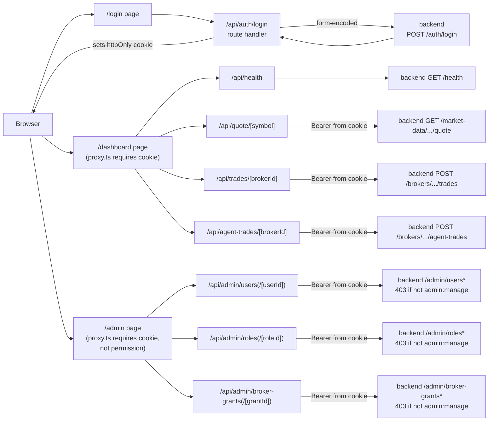

# Architecture

## Current (Phase 1-22)

```mermaid
flowchart LR
    client[Client] --> login["POST /auth/login"]
    login --> token[JWT access token]
    token --> perm["require_permission\ntrade:submit:paper"]
    perm -->|403 if missing| grantcheck["require_broker_access\nbroker exists? grant exists?"]
    grantcheck -->|404 / 403| route["POST /brokers/{id}/trades"]
    client --> health[GET /health]
    client --> quote["GET /market-data/{symbol}/quote\nany authenticated user"]
    client --> admin["/admin/users, /admin/roles,\n/admin/broker-grants\n+ PATCH update/deactivate\nrequires admin:manage"]
    admin --> db
    route --> settings[Settings\nfail-closed live gate\n+ risk limit defaults\n+ fail-closed JWT secret]
    route --> db[(Postgres/TimescaleDB)]

    quote --> router[MarketDataRouter]
    router --> longbridge["LongbridgeMarketDataProvider\nlongport SDK"]
    longbridge -.if estimated_price omitted (D017).-> proposal
    router -.-> snapshot[MarketSnapshot]

    client --> agentroute["POST /brokers/{id}/agent-trades\nsame auth+grant checks"]
    agentroute -->|price always from router,\nnever an agent (D018)| router
    agentroute --> historyprovider["HistoryProvider\nLongbridge candlesticks (D021)"]
    historyprovider --> indicators["sma()/rsi()\ndeterministic, no LLM (D021)"]
    indicators -.->|indicator_context,\noptional| techanalyst
    agentroute --> techanalyst["TechnicalAnalyst.analyze()\nread-only, narrates only, optional (D019/D021)"]
    techanalyst -.->|technical_context,\nomitted on failure| traderagent
    agentroute --> traderagent["TraderAgent.propose()\nside/quantity/stop_distance_pct"]
    traderagent --> llmprovider["LLMProvider\nAnthropic Messages API\nOmniRoute or compatible"]
    techanalyst --> llmprovider
    agentroute --> proposal

    proposal[TradeProposal] --> loadbroker["load_paper_broker\nSELECT ... FOR UPDATE"]
    loadbroker --> persist[OMS submit_trade_and_record]
    persist --> oms[submit_trade]
    oms --> risk[Risk Engine\nevaluate_trade]
    risk -->|approved| broker[PaperBrokerAdapter\nin-memory, this request only]
    risk -->|blocked| rejected[RiskDecision: rejected]
    broker --> fill[Fill]
    persist --> orders[(orders / fills\nappend-only)]
    broker --> savebroker[save_paper_broker]
    savebroker --> brokerstate[(broker_accounts /\nbroker_positions)]
    route --> proposal
    route -->|one commit\nreleases the lock| db
```

`apps/api/app/main.py` boots the app, logs startup mode, exposes `/health`
and five routers (`/auth/login`, the trades router, the agent-trades
router, the admin router, the market-data router). `apps/api/app/core/config.py`
is the single source of the execution-mode gate, default risk limits,
emergency-stop flag, `jwt_secret_key`, and the optional Longbridge/LLM
provider credentials — the first three fail-closed with no defaults,
Longbridge and the LLM provider are each genuinely optional (`None`
unless all three of their respective vars are set). The trading path
requires a Bearer token from `/auth/login`, a role granting
`trade:submit:paper`, AND an explicit `BrokerGrant` for that specific
`broker_id` — all settable through `/admin/users`, `/admin/roles`,
`/admin/broker-grants` after one bootstrap admin is created by direct SQL
(D013). `PATCH /admin/users/{id}` and `PATCH /admin/roles/{id}` (D016)
close the remaining "SQL-only" gap for deactivating a user or changing a
role's permissions after creation — both take effect on a user's very
next request, since `get_current_user` re-checks `is_active` and reloads
the role fresh every time rather than trusting the JWT. A broker's cash/positions are loaded from and saved back to
Postgres around every trade (D014) — the in-process `PaperBrokerRegistry`
is gone entirely; verified by killing and restarting a live server
mid-test and confirming cumulative cash/positions carried over.
`GET /market-data/{symbol}/quote` (D015) is wired to a real Longbridge
provider and now feeds trade submission too (D017, dotted line) — but
only when the caller omits `estimated_price`; a caller-supplied price is
always authoritative and the vendor is never consulted in that case. Real
paper-trading Longbridge credentials were supplied and verified live
2026-08-24 (local, gitignored `.env`, not present by default) — both the
read-only quote endpoint and an omitted-price trade returned genuine live
prices.

`POST /brokers/{id}/agent-trades` (D018) is the first LLM-backed code in
this codebase — a single `TraderAgent` proposes `side`/`quantity`/a stop
distance from a symbol and a free-text directive, routed through any
Anthropic-Messages-API-compatible `LLMProvider` (OmniRoute is the
intended one, not yet reachable in this environment — connection refused
on `127.0.0.1:20128` at implementation time). This is a first, narrow
slice of the "Target" diagram below — just the Trader-agent-to-Risk-Engine
segment, not the parallel analyst layer or research debate. Price is
never the agent's — it always comes from the same live-quote path D017
uses, and the resulting proposal goes through the identical Risk Engine
path a human-submitted trade does, no separate or weaker validation.

Phase 16 (D019) adds the first (one-analyst) slice of the "Target"
diagram's parallel analyst layer: `TechnicalAnalyst.analyze()` reads that
same live quote and writes a short, structured `TechnicalRead`
(`stance`/`summary`/`confidence`) — read-only by construction, no
side/quantity/price field exists on it. It never itself submits or sizes
a trade, and it never computes an indicator (RSI/MACD/etc) itself.
When configured, `agent-trades` passes its read to `TraderAgent.propose()`
as optional additional prompt context alongside the human's directive —
never a separate trusted channel, never required. A missing or failing
analyst never blocks the trade; the context is simply omitted, matching
this codebase's fail-closed-but-never-fabricate posture applied to an
optional feature rather than a hard dependency. There is exactly one
analyst this phase, so no parallel-execution/fan-out infrastructure was
built for it — see D019's "future work" note for when a second analyst
exists.

Phase 18 (D021) closes that "future work" gap: `HistoryProvider`
(`marketdata/history_provider.py`) is a new port for a real price
*series* (distinct from `MarketDataProvider`'s single quote);
`LongbridgeHistoryProvider` implements it via the same Longbridge SDK
connection already used for quotes (D015), fetching daily candlesticks.
`marketdata/indicators.py`'s `sma()`/`rsi()` are pure deterministic
functions computing real values from that series — the LLM never
computes one, only narrates values it's handed. `TechnicalAnalyst` can
now reference real indicator values when history is available, still
honestly falling back to quote-only commentary when it isn't. Verified
live against the real Longbridge API (not just fakes): real daily
closes for `AAPL.US` produced genuine `SMA(20)`/`RSI(14)` values.

## Target (per governing spec, not yet built)



The Risk Engine is the load-bearing boundary in this diagram — everything
above it can be wrong or down without capital risk; everything below it must
still fail closed if the Risk Engine itself is unreachable.

Phase 19 (D022) built a **read-only Portfolio reporting module**
(`apps/api/app/portfolio/`, `GET /brokers/{broker_id}/portfolio`) — not
the "Portfolio Manager" box in the diagram above. That box is a
trade-path component sitting between the Risk Engine and the OMS,
participating in the decision of whether/how a specific approved trade
gets sized and routed; it doesn't exist yet, and nothing in Phase 19
changes the trade path (`trades.py`'s Risk Engine -> OMS -> Broker
Adapter flow is untouched). Phase 19's module instead answers "what does
this broker currently hold and what's its P&L," computed from data the
existing execution layer already persists, for any caller (a future UI,
a human checking a broker's state) to read — it never intercepts, sizes,
or routes a trade.

Phase 23 (D025) built a **backtesting engine**
(`apps/api/app/backtesting/`, `POST /backtests`) — also not the "Portfolio
Manager" box, and not the live trade path at all. It replays one
hard-coded SMA(20)-crossover strategy against real historical closes
through the same Risk Engine and paper-broker fill math the diagram's
trade path uses, but does so entirely outside that path: a fresh,
in-memory `PaperBrokerAdapter` is constructed per backtest run and
discarded, never wired to `oms`/`execution/persistence.py`'s real
broker-state tables. It exists to answer "how would this strategy have
performed, and did the Risk Engine gate it sensibly, over real history" —
a research/validation tool, structurally incapable of moving real
capital or a real broker's position.

Phase 25 (D027) extended the same module with persisted, append-only
snapshot history — `portfolio_snapshots`/`portfolio_snapshot_positions`,
written only when a caller explicitly calls
`POST /brokers/{broker_id}/portfolio/snapshots` (never automatically;
no scheduler exists) and read back via
`GET /brokers/{broker_id}/portfolio/history`. This is still the same
read-only reporting module, not the trade-path "Portfolio Manager" box —
it closes the gap D022 originally flagged (backtesting, alerting, and
performance-attribution all need a real time series, not just a
point-in-time read), but none of those consumers are built yet; Phase 25
only adds the ability to write and read the history they'll eventually
need.

## Database

Postgres 16 + TimescaleDB. Current tables: `users`, `roles`, `assets`,
`brokers` (`0001`), `orders`, `fills` (`0002`), `broker_grants` (`0005`),
`broker_accounts`, `broker_positions` (`0006`). Money columns already use
`NUMERIC`, never float. `orders`/`fills` are append-only audit history;
`broker_accounts`/`broker_positions` are mutable current-state — the two
serve different purposes and are not duplicates of each other (D014).

## Frontend (Phase 17/D020, extended Phase 20/D023)

`apps/web/` is a Next.js 16 (App Router) + TypeScript + Tailwind v4 app.
It never calls the backend directly from the browser — every backend
call is proxied through a same-origin Next.js route handler:



The JWT lives only in an httpOnly cookie set by `/api/auth/login` — the
browser's own JS never reads it, so it's inert against XSS-driven
exfiltration. The cost: every proxied route handler must re-derive the
token from the request cookie and forward it, and there's no CSRF
token yet (mitigated for now by `sameSite: "lax"`). See D020 for the
full localStorage-vs-cookie tradeoff. `proxy.ts` (Next.js 16's rename of
`middleware.ts`) gates `/dashboard` and, as of D023, `/admin` on cookie
presence only — an expired/invalid token still surfaces as the backend's
real 401 through the route handlers, never guessed by `proxy.ts`. The
`/admin` gate is deliberately presence-only, not permission-aware: the
frontend has no way to know whether the current user actually holds
`admin:manage` short of asking the backend, so it doesn't guess — the
nav link is always visible to any authenticated user, and the real
`admin:manage` check happens once, on the backend, on every `/admin/*`
call (D023).

## Deployment

`docker-compose.yml` runs Postgres, Redis, and the API locally. No
staging/production deployment config exists yet. `apps/web/` is not yet
part of `docker-compose.yml` — it runs via `npm run dev`/`npm run build`
+ `npm run start` against `API_BASE_URL` (see `apps/web/README.md`).
