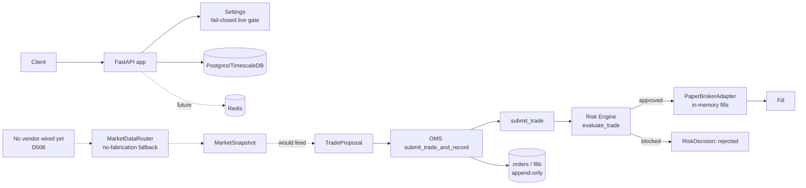
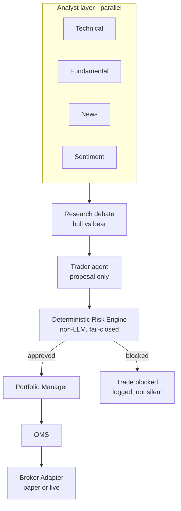

# Architecture

## Current (Phase 1-5)

`apps/api/app/main.py` boots the app, logs startup mode, exposes `/health`.
`apps/api/app/core/config.py` is the single source of the execution-mode gate.
`apps/api/app/db/` holds SQLAlchemy models and the async session factory.
The trading path (right half of the diagram) is wired end-to-end, including
persistence — but has no HTTP entrypoint yet, so it's exercised only by
tests today. The market-data router (dotted lines, left) is built and
tested but has no provider plugged in and nothing yet calls it to build a
`TradeProposal` — that wiring is future work once a vendor is chosen
(D008). The `PaperBrokerAdapter` itself still doesn't persist its own
cash/position ledger (D005) even though the `Order`/`Fill` decision record
now does — those are two different things, and only the latter is done.

## Target (per governing spec, not yet built)

The Risk Engine is the load-bearing boundary in this diagram — everything
above it can be wrong or down without capital risk; everything below it must
still fail closed if the Risk Engine itself is unreachable.

## Database

Postgres 16 + TimescaleDB. Current tables: `users`, `roles`, `assets`,
`brokers` (migration `0001_initial`). Money fields will use `NUMERIC`, never
float, once P&L/position tables exist (spec requirement, not yet
applicable — no such tables yet).

## Deployment

`docker-compose.yml` runs Postgres, Redis, and the API locally. No
staging/production deployment config exists yet.
