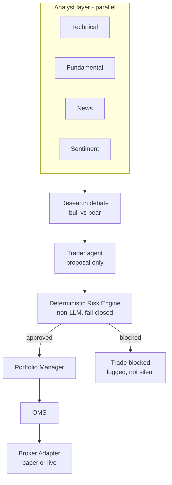

# Architecture

## Current (Phase 1-15)

```mermaid
flowchart LR
    client[Client] --> login["POST /auth/login"]
    login --> token[JWT access token]
    token --> perm["require_permission\ntrade:submit:paper"]
    perm -->|403 if missing| grantcheck["require_broker_access\nbroker exists? grant exists?"]
    grantcheck -->|404 / 403| route["POST /brokers/{id}/trades"]
    client --> health[GET /health]
    client --> quote["GET /market-data/{symbol}/quote\nany authenticated user"]
    client --> admin["/admin/users, /admin/roles,\n/admin/broker-grants\n+ PATCH update/deactivate\nrequires admin:manage"]
    admin --> db
    route --> settings[Settings\nfail-closed live gate\n+ risk limit defaults\n+ fail-closed JWT secret]
    route --> db[(Postgres/TimescaleDB)]

    quote --> router[MarketDataRouter]
    router --> longbridge["LongbridgeMarketDataProvider\nlongport SDK"]
    longbridge -.if estimated_price omitted (D017).-> proposal
    router -.-> snapshot[MarketSnapshot]

    client --> agentroute["POST /brokers/{id}/agent-trades\nsame auth+grant checks"]
    agentroute --> traderagent["TraderAgent.propose()\nside/quantity/stop_distance_pct"]
    traderagent --> llmprovider["LLMProvider\nAnthropic Messages API\nOmniRoute or compatible"]
    agentroute -->|price always from router,\nnever the agent (D018)| router
    agentroute --> proposal

    proposal[TradeProposal] --> loadbroker["load_paper_broker\nSELECT ... FOR UPDATE"]
    loadbroker --> persist[OMS submit_trade_and_record]
    persist --> oms[submit_trade]
    oms --> risk[Risk Engine\nevaluate_trade]
    risk -->|approved| broker[PaperBrokerAdapter\nin-memory, this request only]
    risk -->|blocked| rejected[RiskDecision: rejected]
    broker --> fill[Fill]
    persist --> orders[(orders / fills\nappend-only)]
    broker --> savebroker[save_paper_broker]
    savebroker --> brokerstate[(broker_accounts /\nbroker_positions)]
    route --> proposal
    route -->|one commit\nreleases the lock| db
```

`apps/api/app/main.py` boots the app, logs startup mode, exposes `/health`
and five routers (`/auth/login`, the trades router, the agent-trades
router, the admin router, the market-data router). `apps/api/app/core/config.py`
is the single source of the execution-mode gate, default risk limits,
emergency-stop flag, `jwt_secret_key`, and the optional Longbridge/LLM
provider credentials — the first three fail-closed with no defaults,
Longbridge and the LLM provider are each genuinely optional (`None`
unless all three of their respective vars are set). The trading path
requires a Bearer token from `/auth/login`, a role granting
`trade:submit:paper`, AND an explicit `BrokerGrant` for that specific
`broker_id` — all settable through `/admin/users`, `/admin/roles`,
`/admin/broker-grants` after one bootstrap admin is created by direct SQL
(D013). `PATCH /admin/users/{id}` and `PATCH /admin/roles/{id}` (D016)
close the remaining "SQL-only" gap for deactivating a user or changing a
role's permissions after creation — both take effect on a user's very
next request, since `get_current_user` re-checks `is_active` and reloads
the role fresh every time rather than trusting the JWT. A broker's cash/positions are loaded from and saved back to
Postgres around every trade (D014) — the in-process `PaperBrokerRegistry`
is gone entirely; verified by killing and restarting a live server
mid-test and confirming cumulative cash/positions carried over.
`GET /market-data/{symbol}/quote` (D015) is wired to a real Longbridge
provider and now feeds trade submission too (D017, dotted line) — but
only when the caller omits `estimated_price`; a caller-supplied price is
always authoritative and the vendor is never consulted in that case. Real
paper-trading Longbridge credentials were supplied and verified live
2026-08-24 (local, gitignored `.env`, not present by default) — both the
read-only quote endpoint and an omitted-price trade returned genuine live
prices.

`POST /brokers/{id}/agent-trades` (D018) is the first LLM-backed code in
this codebase — a single `TraderAgent` proposes `side`/`quantity`/a stop
distance from a symbol and a free-text directive, routed through any
Anthropic-Messages-API-compatible `LLMProvider` (OmniRoute is the
intended one, not yet reachable in this environment — connection refused
on `127.0.0.1:20128` at implementation time). This is a first, narrow
slice of the "Target" diagram below — just the Trader-agent-to-Risk-Engine
segment, not the parallel analyst layer or research debate. Price is
never the agent's — it always comes from the same live-quote path D017
uses, and the resulting proposal goes through the identical Risk Engine
path a human-submitted trade does, no separate or weaker validation.

## Target (per governing spec, not yet built)



The Risk Engine is the load-bearing boundary in this diagram — everything
above it can be wrong or down without capital risk; everything below it must
still fail closed if the Risk Engine itself is unreachable.

## Database

Postgres 16 + TimescaleDB. Current tables: `users`, `roles`, `assets`,
`brokers` (`0001`), `orders`, `fills` (`0002`), `broker_grants` (`0005`),
`broker_accounts`, `broker_positions` (`0006`). Money columns already use
`NUMERIC`, never float. `orders`/`fills` are append-only audit history;
`broker_accounts`/`broker_positions` are mutable current-state — the two
serve different purposes and are not duplicates of each other (D014).

## Deployment

`docker-compose.yml` runs Postgres, Redis, and the API locally. No
staging/production deployment config exists yet.
