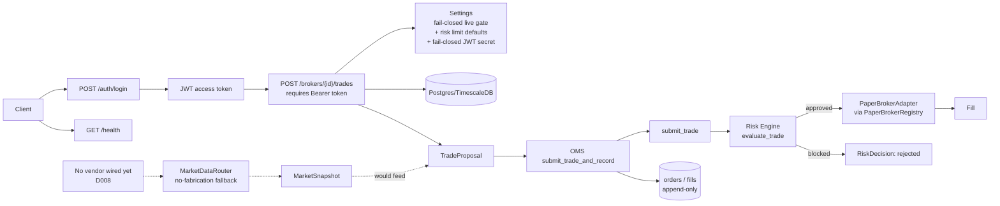
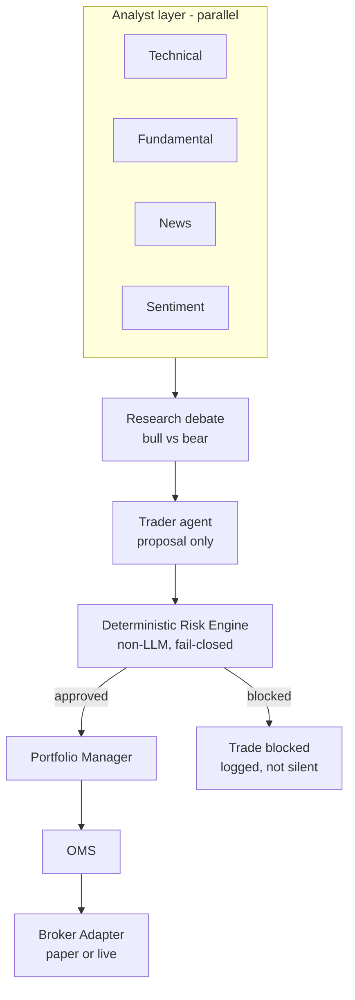

# Architecture

## Current (Phase 1-7)

`apps/api/app/main.py` boots the app, logs startup mode, creates the
`PaperBrokerRegistry`, exposes `/health` and both routers (`/auth/login`,
the trades router). `apps/api/app/core/config.py` is the single source of
the execution-mode gate, default risk limits, emergency-stop flag, and now
also `jwt_secret_key` — fail-closed the same way, no default.
The trading path requires a Bearer token from `/auth/login` — verified
live against a running server (401 with no token, 200 with a real one, the
resulting order's `submitted_by_user_id` confirmed via SQL). The
market-data router (dotted lines, left) is built and tested but has no
provider plugged in and nothing yet calls it to build a `TradeProposal`;
the HTTP endpoint currently takes price/timestamp directly from the caller
instead (future work once a vendor is chosen, D008). The
`PaperBrokerAdapter`/`PaperBrokerRegistry` still don't persist
cash/position state (D005/D009) even though the `Order`/`Fill` decision
record now does — a restart resets accounts silently while the audit trail
survives. No registration endpoint or role-based authorization exists yet
(D010) — any authenticated user can trade on any broker_id they know.

## Target (per governing spec, not yet built)

The Risk Engine is the load-bearing boundary in this diagram — everything
above it can be wrong or down without capital risk; everything below it must
still fail closed if the Risk Engine itself is unreachable.

## Database

Postgres 16 + TimescaleDB. Current tables: `users`, `roles`, `assets`,
`brokers` (migration `0001_initial`). Money fields will use `NUMERIC`, never
float, once P&L/position tables exist (spec requirement, not yet
applicable — no such tables yet).

## Deployment

`docker-compose.yml` runs Postgres, Redis, and the API locally. No
staging/production deployment config exists yet.
