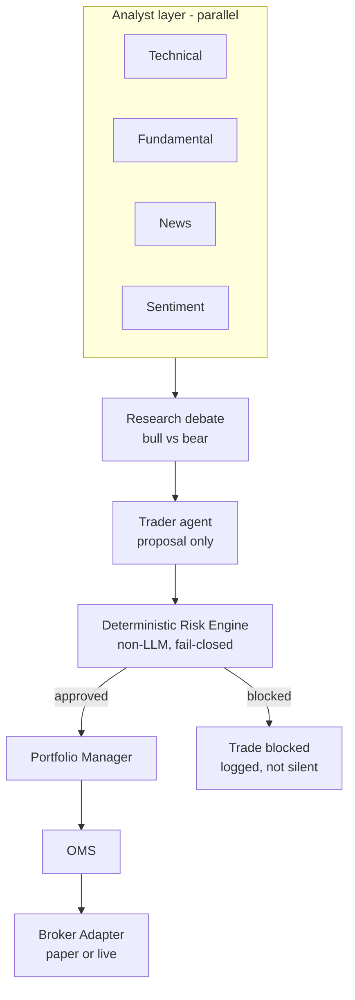

# Architecture

## Current (Phase 1-11)

```mermaid
flowchart LR
    client[Client] --> login["POST /auth/login"]
    login --> token[JWT access token]
    token --> perm["require_permission\ntrade:submit:paper"]
    perm -->|403 if missing| grantcheck["require_broker_access\nbroker exists? grant exists?"]
    grantcheck -->|404 / 403| route["POST /brokers/{id}/trades"]
    client --> health[GET /health]
    client --> admin["/admin/users, /admin/roles,\n/admin/broker-grants\nrequires admin:manage"]
    admin --> db
    route --> settings[Settings\nfail-closed live gate\n+ risk limit defaults\n+ fail-closed JWT secret]
    route --> db[(Postgres/TimescaleDB)]

    vendors[No vendor wired yet\nD008] -.-> router[MarketDataRouter\nno-fabrication fallback]
    router -.-> snapshot[MarketSnapshot]
    snapshot -.would feed.-> proposal

    proposal[TradeProposal] --> loadbroker["load_paper_broker\nSELECT ... FOR UPDATE"]
    loadbroker --> persist[OMS submit_trade_and_record]
    persist --> oms[submit_trade]
    oms --> risk[Risk Engine\nevaluate_trade]
    risk -->|approved| broker[PaperBrokerAdapter\nin-memory, this request only]
    risk -->|blocked| rejected[RiskDecision: rejected]
    broker --> fill[Fill]
    persist --> orders[(orders / fills\nappend-only)]
    broker --> savebroker[save_paper_broker]
    savebroker --> brokerstate[(broker_accounts /\nbroker_positions)]
    route --> proposal
    route -->|one commit\nreleases the lock| db
```

`apps/api/app/main.py` boots the app, logs startup mode, exposes `/health`
and three routers (`/auth/login`, the trades router, the admin router).
`apps/api/app/core/config.py` is the single source of the execution-mode
gate, default risk limits, emergency-stop flag, and `jwt_secret_key` — all
fail-closed, no defaults. The trading path requires a Bearer token from
`/auth/login`, a role granting `trade:submit:paper`, AND an explicit
`BrokerGrant` for that specific `broker_id` — all settable through
`/admin/users`, `/admin/roles`, `/admin/broker-grants` after one bootstrap
admin is created by direct SQL (D013). A broker's cash/positions are now
loaded from and saved back to Postgres around every trade (D014) — the
in-process `PaperBrokerRegistry` is gone entirely. Verified live in the
way that matters most for this: submitted a trade, killed the running
server process, started a fresh one, submitted a second trade on the same
broker — the resulting cash balance and both positions were only
explainable if state genuinely survived the restart. The market-data
router (dotted lines, left) is built and tested but has no provider
plugged in and nothing yet calls it to build a `TradeProposal`; the HTTP
endpoint currently takes price/timestamp directly from the caller instead
(future work once a vendor is chosen, D008).

## Target (per governing spec, not yet built)

The Risk Engine is the load-bearing boundary in this diagram — everything
above it can be wrong or down without capital risk; everything below it must
still fail closed if the Risk Engine itself is unreachable.

## Database

Postgres 16 + TimescaleDB. Current tables: `users`, `roles`, `assets`,
`brokers` (`0001`), `orders`, `fills` (`0002`), `broker_grants` (`0005`),
`broker_accounts`, `broker_positions` (`0006`). Money columns already use
`NUMERIC`, never float. `orders`/`fills` are append-only audit history;
`broker_accounts`/`broker_positions` are mutable current-state — the two
serve different purposes and are not duplicates of each other (D014).

## Deployment

`docker-compose.yml` runs Postgres, Redis, and the API locally. No
staging/production deployment config exists yet.
